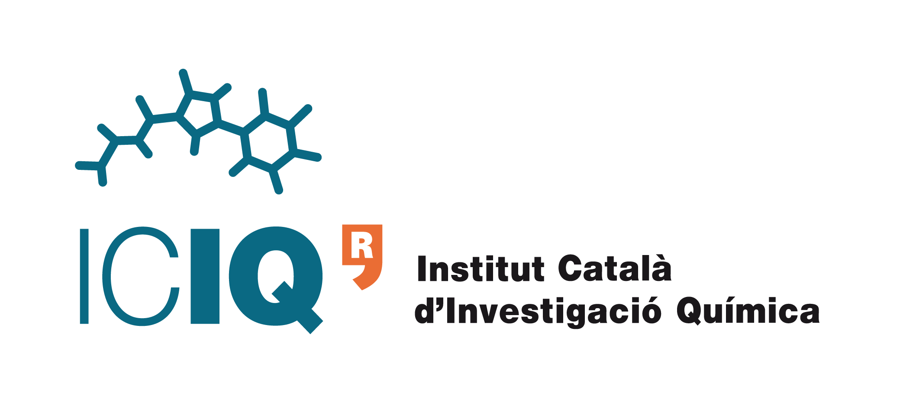
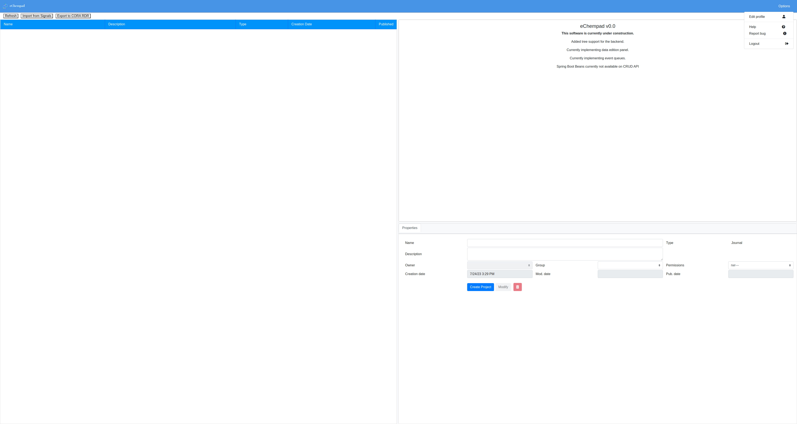
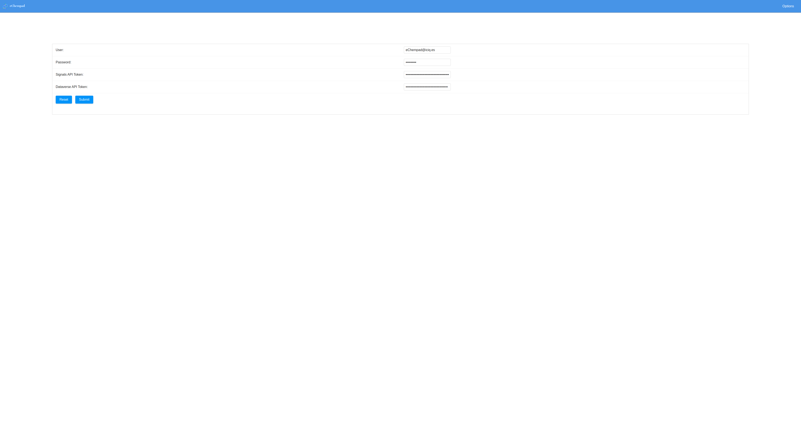
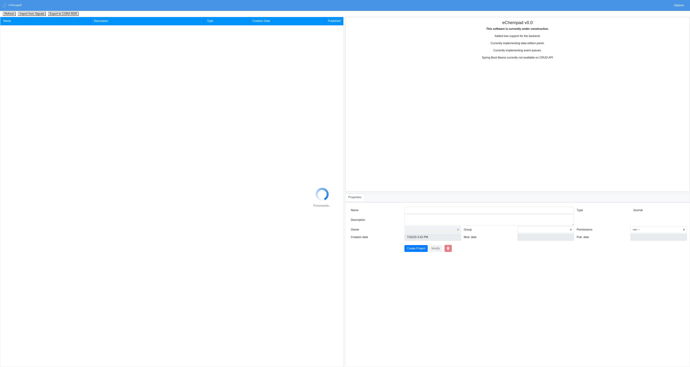
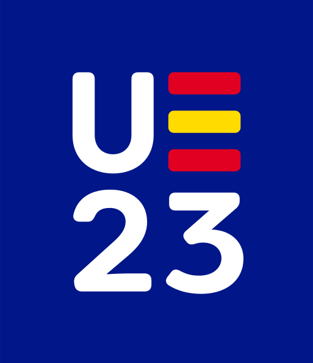

<a name="readme-top"></a>

<!-- PROJECT SHIELDS -->
[![Code quality][codacy-shield]][codacy-url]
[![Top language][language-shield]][language-url]
[![GNU GPL v3 License][license-shield]][license-url]
[![Lines of code][loc-shield]][loc-url]
[![Number of commits since v0.1][commit-shield]][commit-url]
[![Commit activity][activity-shield]][activity-url]
[![Docker size image][docker-size-shield]][docker-size-url]


<!-- PROJECT LOGO -->
<br />
<div align="center">
  <a href="https://iciq.cat">
    
  </a>

<h6 align="center">presents</h3>


<!-- 
<h3 align="center">eChempad</h3> -->

  <p align="center">
    An open-source web application to manage the entire
data life-cycle of experiments and assays from Experimental Chemistry and related Science disciplines.
    <br />
    <a href="https://iciq-dmp.github.io/"><strong>Explore the docs »</strong></a>
    <br />
    <br />
    <a href="https://echempad.iciq.es">View Demo</a>
    ·
    <a href="https://github.com/AleixMT/eChempad/issues/new">Report Bug</a>
    ·
    <a href="https://github.com/AleixMT/eChempad/issues/new">Request Feature</a>
  </p>
</div>


<!-- TABLE OF CONTENTS -->
<details>
  <summary>Table of Contents</summary>
  <ol>
    <li>
      <a href="#about-the-project">About The Project</a>
      <ul>
        <li><a href="#built-with">Built With</a></li>
      </ul>
    </li>
    <li>
      <a href="#getting-started">Getting Started</a>
      <ul>
        <li><a href="#try-the-platform">Try the platform</a></li>
        <li><a href="#deploy-and-run-the-software-locally">Deploy and run the software locally</a></li>
        <li><a href="#with-docker">Deploy and run the software locally with Docker</a></li>
        <li><a href="#manually">Deploy and run the software locally manually</a></li>
        <li><a href="#Learning-how-it-works">Learning how it works</a></li>
        <li><a href="#set-up-a-development-environment">Set up a development environment</a></li>
      </ul>
    </li>
    <li><a href="#usage">Usage</a></li>
    <li><a href="#roadmap">Roadmap</a></li>
    <li><a href="#contributing">Contributing</a></li>
    <li><a href="#license">License</a></li>
    <li><a href="#contact">Contact</a></li>
    <li><a href="#acknowledgments">Acknowledgments</a></li>
  </ol>
</details>


<!-- ABOUT THE PROJECT -->
## About The Project

[![Product Name Screen Shot][product-screenshot]](https://echempad.iciq.es)

The **Chem**istry **e**lectronic note**pad** (eChempad) platform is a suite of web services oriented to manage the entire
data life-cycle of experiments and assays from **Experimental Chemistry** and related Science disciplines.

Currently, the eChempad platform allows researchers to extract experimentation data from the 
[PerkinElmer Signals Notebook](https://perkinelmerinformatics.com/products/research/signals-notebook-eln) in bulk, 
enrich them with metadata, and finally publish them into [CORA RDR](https://dataverse.csuc.cat/) a 
[Dataverse](https://dataverse.org/) instance maintained by the 
[Consorci de Serveis Universitaris de Catalunya (CSUC)](https://www.csuc.cat/en). 

The eChempad platform appears as an answer to the digitization needs of experimental chemists at [Institut Català
d'Investigació Química (ICIQ)](https://www.iciq.org/). This platform intends to be an analogous example of the
successful platform for **Computational Chemistry** developed at ICIQ,
[ioChem-BD](https://www.iochem-bd.org/index-introduction.jsp).

<p align="right">(<a href="#readme-top">back to top</a>)</p>


### Built With

This section lists any major frameworks/libraries used to bootstrap the eChempad platform:

* [![Bootstrap][Bootstrap-shield]][Bootstrap-url]
* [![JQuery][JQuery-shield]][JQuery-url]
* [![PostgreSQL][postgres-shield]][postgres-url]
* [![Java][java-shield]][java-url]
* [![Spring Boot][springboot-shield]][springboot-url]
* [![Spring Framework][spring-shield]][spring-url]
* [![ZK][zk-shield]][zk-url]
* [![Hibernate][hibernate-shield]][hibernate-url]
* [![Jackson][jackson-shield]][jackson-url]

<p align="right">(<a href="#readme-top">back to top</a>)</p>


<!-- GETTING STARTED -->
## Getting Started

#### Try the platform
To get started, you will probably want to try the software from the official web page 
**[echempad.iciq.es](http://echempad.iciq.es)**.
eChempad executes in your browser and does not require any installation.

Check the [user guide](https://iciq-dmp.github.io/eChempad/User-Guide/) from the 
[official documentation](https://iciq-dmp.github.io/) to know more. 

#### Deploy and run the software locally
###### With Docker
The fastest way to get a copy up and running in your local machine is using *Docker* with `docker-compose`.

Assuming that you have them installed on your machine, use these commands to pull the latest version of the 
[eChempad docker image](https://hub.docker.com/r/aleixmt/echempad) and [postgreSQL](https://hub.docker.com/_/postgres)
to run them in containers:
```shell
wget https://raw.githubusercontent.com/AleixMT/eChempad/master/docker-compose.yaml
sudo docker-compose up -d
```

Then, open a browser and navigate to the URL `http://localhost` and eChempad will be displayed and ready to work.

Check the [running with Docker guide](https://iciq-dmp.github.io/eChempad/Developer-Guide/Running-with-docker/) from the
[official documentation](https://iciq-dmp.github.io/) to know more.

###### Manually
If you want to run the software locally without using *Docker*, you may want to check [how to install the dependencies 
of eChempad into your machine](https://iciq-dmp.github.io/eChempad/Developer-Guide/Local-installation/) and [how to 
compile and run the software manually](https://iciq-dmp.github.io/eChempad/Developer-Guide/Local-running-and-debugging/). 

#### Learning how it works
If you want to understand how eChempad works we recommend that you read the 
[developer guide](https://iciq-dmp.github.io/eChempad/Developer-Guide/) from the
[official documentation](https://iciq-dmp.github.io/).

#### Set up a development environment
If you want to make a contribution to the project or want to debug an error, you 
will need a functional development environment. This environment involves many tools and utilities [in addition 
to the ones needed to run the software manually](https://iciq-dmp.github.io/eChempad/Developer-Guide/Local-installation/).

You can follow [this guide](https://iciq-dmp.github.io/eChempad/Developer-Guide/Setting-up-development-environment/) 
from the [official documentation](https://iciq-dmp.github.io/) to learn how to set up the development environment.

<p align="right">(<a href="#readme-top">back to top</a>)</p>


<!-- USAGE EXAMPLES -->
<!-- Use this space to show useful examples of how a project can be used. Additional screenshots, code examples and demos 
work well in this space. You may also link to more resources. -->

## Usage
Open a browser and navigate to the URL of eChempad. The first thing you will find is the login page:
[![Login eChempad][login-screenshot]](https://echempad.iciq.es)

By default, **eChempad has an administrator user with the username `eChempad@iciq.es` and password `chemistry`**. 

>*Do not 
forget to change the password of the administrator user if you plan to use your eChempad instance in real scientific 
production.* 

After that, you will be received by the home page:
[![Home eChempad][home-empty-screenshot]](https://echempad.iciq.es).

If you want to retrieve from a Signals Notebook or want to upload to a Dataverse instance, you need to introduce the 
corresponding API tokens into your user by editing your profile. To do so, click *edit profile*
from the *options*  menu, in the left superior corner of the page:


You will land on the profile page where you can introduce the API tokens in the corresponding fields. Use *submit* to
save your changes:


Then, go back to the home page by clicking the eChempad logo on the superior left corner. You will be back to the home 
page of eChempad.

Now, you can click the *import from Signals Button* on the left of the top bar. This will trigger the import of the 
available resources with the previously introduced API token from Signals. This operation usually takes some minutes, so 
you will need to have patience. While the operation is running, a loading icon will appear in the page like this:


When the operation ends, the imported resources will appear in the home page. Reload the page if they do not appear. It
may look similar to this:
[![Home full eChempad][product-screenshot]](https://echempad.iciq.es)

Now, you can edit the metadata of the imported resources by using the form in the inferior right area of the screen. 
You can also delete the resources that you do not need by clicking the trash button in the same form. 

When you are finished editing your data and want to export a resource to Dataverse, you have to select the resource to
export and click *export to CORA RDR*. A loading sign will appear while the operation is running the same as when 
importing from a Signals Notebook.

When the loading sign disappears, your resources will be available in the CORA RDR Dataverse instance.

_For more examples, please refer to the [user guide](https://iciq-dmp.github.io/eChempad/User-Guide/) from the 
[official documentation](https://iciq-dmp.github.io/)_

<p align="right">(<a href="#readme-top">back to top</a>)</p>


<!-- ROADMAP -->
## Roadmap
- [x] Frontend addition with ZK
- [x] Change backend to composite structure
- [x] Refactored ACLs
- [ ] Write tests
- [ ] Customize license plugins
- [ ] Finish API to import / export
- [ ] Integrate API abstractions into the front-end
- [ ] Create usage example in the readme

See the [open issues](https://github.com/AleixMT/eChempad/issues) for a full list of proposed features (and known issues).

<p align="right">(<a href="#readme-top">back to top</a>)</p>


<!-- CONTRIBUTING -->
## Contributing
This is an open-source project, so any contributions are **greatly appreciated** ❤. You can start by taking a look to 
the [`Developer guide`](https://iciq-dmp.github.io/eChempad/Developer-Guide/) to understand how eChempad works.

If you have an issue or suggestion that would make eChempad better, please 
[open a new issue](https://github.com/AleixMT/eChempad/issues/new) explaining your inquiry. We will try to satisfy your 
needs as soon as possible. 

If you want to make a contribution to eChempad by yourself, please 
[open a new issue](https://github.com/AleixMT/eChempad/issues/new) so we can discuss the reach of your contribution. 
After that, [fork the repo](https://github.com/AleixMT/eChempad/fork), implement your change and create a 
[pull request](https://github.com/AleixMT/eChempad/compare) from your fork to the `develop` branch. We will merge your 
changes as soon as possible, so they are available in the next releases of eChempad.

So, for each change that you want to do to eChempad by yourself, you will need to:
1. [Fork the repo](https://github.com/AleixMT/eChempad/fork).
2. Create your Feature Branch (`git checkout -b feature/AmazingFeature`).
3. Add and commit your Changes (`git add src; git commit -am 'Add some AmazingFeature'`).
4. Push to the Branch (`git push origin feature/AmazingFeature`).
5. Repeat steps 3 and 4 as many times as you need.
6. [Open a pull request from your fork to the develop branch](https://github.com/AleixMT/eChempad/compare).
7. Repeat steps 3 and 4 if further changes are required.

Do not forget to give the project a star ⭐ on GitHub!

<p align="right">(<a href="#readme-top">back to top</a>)</p>


<!-- LICENSE -->
## License


Distributed under the [GNU AFFERO GENERAL PUBLIC LICENSE, Version 3](https://www.gnu.org/licenses/agpl-3.0.en.html). 
See [`LICENSE`](https://github.com/AleixMT/eChempad/blob/master/LICENSE) to obtain a copy of the therms of this license.
See also [`LICENSE.md`](https://github.com/AleixMT/eChempad/blob/master/LICENSE.md) for more information about the 
licensing state of this project.

This software was developed by [Aleix Mariné-Tena](https://github.com/AleixMT) using a grant of [*Personal Técnico de
Apoyo* (Technical staff for support) with reference *PTA2020-019734-I*](https://www.aei.gob.es/convocatorias/buscador-convocatorias/ayudas-contratos-personal-tecnico-apoyo-pta-2020)
from [*Ministerio de Ciencia e Innovación*](https://www.ciencia.gob.es/) from the [spanish government](https://www.lamoncloa.gob.es/Paginas/index.aspx).

**eChempad ultimately belongs to ICIQ and has the control over the licensing and distribution therms.**

>Copyright 2020-2023 Institute of Chemical Research of Catalonia (ICIQ)


>This program is free software: you can redistribute it and/or modify it under the terms of the GNU Affero General Public
License as published by the Free Software Foundation, either version 3 of the License, or (at your option) any later 
version.
> 
>This program is distributed in the hope that it will be useful, but WITHOUT ANY WARRANTY; without even the implied warranty of
MERCHANTABILITY or FITNESS FOR A PARTICULAR PURPOSE. See the GNU Affero General Public License for more details.

<p align="right">(<a href="#readme-top">back to top</a>)</p>


<!-- CONTACT -->
## Contact

>ICIQ data steward & main developer of *eChempad*: Aleix Mariné-Tena - [dmp@iciq.es](dmp@iciq.es) 📫

You can also reach us on Twitter [@ICIQchem](https://twitter.com/ICIQchem).

You can get more information of our work and research on our official web page https://iciq.cat.

<p align="right">(<a href="#readme-top">back to top</a>)</p>


<!-- ACKNOWLEDGMENTS -->
## Acknowledgments
*eChempad* was possible thanks to a grant of [*Personal Técnico de
Apoyo* (Technical staff for support) with reference *PTA2020-019734-I*](https://www.aei.gob.es/convocatorias/buscador-convocatorias/ayudas-contratos-personal-tecnico-apoyo-pta-2020)
from [*Ministerio de Ciencia e Innovación*](https://www.ciencia.gob.es/) from the [spanish government](https://www.lamoncloa.gob.es/Paginas/index.aspx).

<div id="image-table" align="center">
    <table>
	    <tr>
    	    <td style="padding:10px">
                <a href="https://www.lamoncloa.gob.es/Paginas/index.aspx"></a>
      	    </td>
            <td style="padding:10px">
                <a href="https://www.ciencia.gob.es/"></a>
            </td>
            <td style="padding:10px">
                <a href="https://spanish-presidency.consilium.europa.eu/"></a>
            </td>
            <td style="padding:10px">
                <a href="https://www.aei.gob.es/"></a>
            </td>
            <td style="padding:10px">
                <a href="https://ec.europa.eu/esf/home.jsp"></a>
            </td>
        </tr>
    </table>
</div>

<p align="right">(<a href="#readme-top">back to top</a>)</p>


## Credits
### Institutions involved in the eChempad project

- [Institute of Chemical Research of Catalonia (ICIQ)](https://www.iciq.es/): ICIQ, the institution that developed
*eChempad*. 

- [Catalan University Services Consortium (CSUC)](https://www.csuc.cat/en): CSUC, the institution that developed 
[CORA RDR](https://www.csuc.cat/en/serveis/cora-repositori-de-dades-de-recerca), a Dataverse instance to store the data 
from the catalan scientific research.

### People involved in the eChempad development
* **Aleix Mariné-Tena (ICIQ)**: Main developer of *eChempad*. ICIQ data steward. 
* **Moisés Álvarez (ICIQ - URV)**: Main developer of [ioChem-BD](https://www.iochem-bd.org/). Main developer counsellor. 
* **Dr. Carles Bo (ICIQ)**: Product owner. Supervisor. Main scientific counsellor and contributor. 
[Research Leader at Bo Group](https://twitter.com/HartreeFoca). 
* **Dra. Imma Escofet (ICIQ)**: Scientific contributor and counsellor. Group Scientific Coordinator at Ballesté group. 
Presented examples of integration with Signals in the 
[Open Data Day](https://www.iciq.org/agenda/opendata-day/). Provides real datasets to work with. Explains the needs of 
researchers of her group towards *eChempad* and ICIQ digitalization.
* **Dra. Gemma Aragay (ICIQ)**: Scientific contributor. Group Scientific Coordinator at Ballesté group. Explained the 
needs of researchers of her group towards *eChempad* and ICIQ digitalization.
* **Dra. Sonia Sayalero (ICIQ)**: Project counsellor. Manager of the Institutional Strengthening Unit at ICIQ. 
Coordinates the Severo Ochoa program and the development of eChempad. Involved in the data management plan at ICIQ.  
* **Martin Gumbau (ICIQ)**: System administrator at ICIQ theoretical groups. Maintains the physical machine used to 
develop *eChempad*.
* **Angel Mosquera (ICIQ)**: IT Manager at ICIQ. Provides and maintains the infrastructure to host the *eChempad* 
application and other services related with the ICIQ digitalization. 


<!-- MARKDOWN LINKS & IMAGES -->
<!-- https://www.markdownguide.org/basic-syntax/#reference-style-links -->
[forks-shield]: https://img.shields.io/github/forks/AleixMT/eChempad.svg?style=for-the-badge&label=Fork&maxAge=2592000  
[forks-url]: https://github.com/AleixMT/eChempad/network/members
[license-shield]: https://img.shields.io/github/license/AleixMT/eChempad?style=flat-square&color=darkgreen&logo=gnu
[license-url]: https://github.com/AleixMT/eChempad/blob/master/LICENSE.txt
[product-screenshot]: .github/images/home_full-screenshot.png
[login-screenshot]: .github/images/login-screenshot.png
[home-empty-screenshot]: .github/images/home_empty-screenshot.png

[codacy-shield]: https://app.codacy.com/project/badge/Grade/9d77f6c73bab4a11b847d131146fc243
[codacy-url]: https://app.codacy.com/gh/AleixMT/eChempad/dashboard
[language-shield]: https://img.shields.io/github/languages/top/AleixMT/eChempad?style=flat-square&color=yellow&logo=oracle
[language-url]: https://www.java.com/es/
[loc-shield]: https://img.shields.io/tokei/lines/gitlab/AleixMT/eChempad?style=flat-square&logo=github
[loc-url]: https://github.com/AleixMT/eChempad
[commit-shield]: https://img.shields.io/github/last-commit/AleixMT/eChempad/develop?style=flat-square&logo=github
[commit-url]: https://github.com/AleixMT/eChempad/issues
[activity-shield]: https://img.shields.io/github/commit-activity/y/AleixMT/eChempad?style=flat-square&color=black&logo=github
[activity-url]: https://github.com/AleixMT/eChempad/graphs/commit-activity
[docker-size-shield]: https://img.shields.io/docker/image-size/aleixmt/echempad/v1.3?style=flat-square&color=purple&logo=docker
[docker-size-url]: https://hub.docker.com/r/aleixmt/echempad

[Bootstrap-shield]: https://img.shields.io/badge/Bootstrap-4.6.1-white?style=for-the-badge&logo=bootstrap&logoColor=white
[Bootstrap-url]: https://getbootstrap.com 
[JQuery-shield]: https://img.shields.io/badge/jQuery-3.3.1-orange?style=for-the-badge&logo=jquery&logoColor=white
[JQuery-url]: https://jquery.com
[postgres-shield]: https://img.shields.io/badge/postgres-42.5.1-blue?style=for-the-badge&logo=postgresql&logoColor=white
[postgres-url]: https://www.postgresql.org/
[java-shield]: https://img.shields.io/badge/java-openjdk_1.8.0_352-yellow?style=for-the-badge&logo=oracle&logoColor=white
[java-url]: https://www.java.com/es/
[git-shield]: https://img.shields.io/badge/git-2.25.1-black?style=for-the-badge&logo=git
[git-url]: https://git.com
[bash-shield]: https://img.shields.io/badge/bash-5.0.17-black?style=for-the-badge&logo=gnubash
[bash-url]: https://www.gnu.org/software/bash/
[springboot-shield]: https://img.shields.io/badge/springboot-2.5.4-green?style=for-the-badge&logo=spring
[springboot-url]: https://spring.io/projects/spring-boot
[spring-shield]: https://img.shields.io/badge/spring_framework-5.3.9-green?style=for-the-badge&logo=spring
[spring-url]: https://spring.io/
[zk-shield]: https://img.shields.io/badge/zk-8.6.0.1-purple?style=for-the-badge&logo=zazzle
[zk-url]: https://www.zkoss.org/
[hibernate-shield]: https://img.shields.io/badge/hibernate-5.4.32.Final-red?style=for-the-badge&logo=hibernate
[hibernate-url]: https://www.zkoss.org/
[jackson-shield]: https://img.shields.io/badge/jackson-2.11.1-brown?style=for-the-badge&logo=json
[jackson-url]: https://github.com/FasterXML/jackson